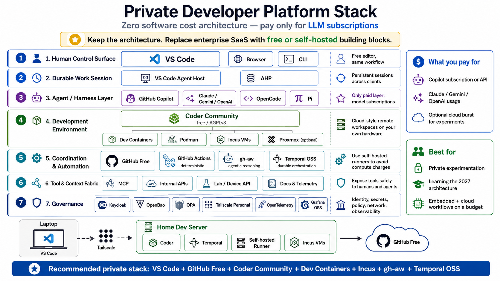

# devenv-cloud

**A Docker-first, single-repository private developer platform** for remote
development, agent-assisted coding, GitHub automation, durable orchestration,
and governance/observability — running entirely on one Linux server, with no
inbound Internet exposure and no paid cloud infrastructure required.



## What this is

devenv-cloud lets a developer open VS Code, connect to a durable remote
session over Tailscale/SSH, and drive an AI coding agent (OpenCode, Pi,
Copilot, Claude, Gemini, ...) against an isolated, reproducible Docker
workspace — with the session surviving editor restarts, workspace restarts,
and (eventually) worker crashes. Everything needed to stand it up lives in
this one repository: no external SaaS dependency beyond GitHub.com (as a
coordination plane) and your own LLM provider.

It is built around three independent **durability levels**, deliberately
never conflated:

| Level | What survives | Proven by |
|---|---|---|
| UI durability | Closing/reopening VS Code | VS Code Agent Host (AHP) |
| Workspace durability | Workspace container restart | Coder's persistent home volume |
| Process durability | Worker crash mid-execution | Temporal's Event History (Postgres) |

See [`docs/ARCHITECTURE.md`](docs/ARCHITECTURE.md) for the full C4-model
breakdown (Context → Container → Component) and
[`docs/INITIAL.md`](docs/INITIAL.md) for the authoritative, detailed
implementation plan this repository executes.

## Repository layout

```
devenv-cloud/
├── Makefile                  # host prep, stack lifecycle, workspace image build
├── compose.yaml               # Postgres + Coder (platform control plane)
├── coder/                     # workspace container image + Terraform template
│   ├── Dockerfile
│   └── templates/docker-workspace/
├── agent-host/                # VS Code Agent Host / sandbox security baseline
├── scripts/                    # host checks, SSH bridging, worktree/session tooling
├── sessions/                    # agent session & git-worktree isolation policy
├── examples/hello-service/      # minimal toolchain smoke test for a fresh workspace
├── docs/
│   ├── INITIAL.md               # authoritative implementation plan (source of truth)
│   ├── ARCHITECTURE.md           # condensed C4 summary of INITIAL.md
│   ├── phases/                   # INITIAL.md split into 5 deliverable phases
│   └── milestone-reports/        # evidence report per completed milestone
├── doc/plan/                     # internal plan-driven build process (factory.sh state)
└── AGENTS.md                     # accumulated agent-facing knowledge for this repo
```

## Quickstart

Requirements: a Linux host with Docker Engine + Compose v2, ~100 GB free
disk, and outbound HTTPS access. No inbound ports need to be exposed beyond
what you choose to reach over your own VPN/Tailscale network.

```bash
# 1. Verify the host meets the baseline requirements
make doctor

# 2. Configure environment (Coder version, ports, DB credentials)
cp .env.example .env
$EDITOR .env

# 3. Start the platform control plane (Postgres + Coder)
make up
make status   # or: make logs

# 4. Build the Coder workspace image (Docker workspaces run this image)
make coder-workspace-build

# 5. Push the Terraform template and create a workspace via the Coder UI/CLI
#    (see coder/templates/docker-workspace/README.md)
```

Once a workspace is running, `scripts/configure-coder-ssh.sh` wires up local
SSH config so VS Code's Agent Host can connect to it as
`ssh coder.<workspace-name>`, and `scripts/verify-ahp-session.sh` proves the
Agent Host protocol handshake actually succeeds end-to-end.

See [Makefile targets](#makefile-targets) below and `AGENTS.md` for the full
command reference, and each script's own header comment for details.

## Makefile targets

| Target | Milestone | Purpose |
|---|---|---|
| `make doctor` | M0 | Verify host OS/arch/tooling/disk/ports meet baseline requirements. |
| `make up` | M1 | Start the platform stack (Postgres + Coder) in the background. |
| `make down` | — | Stop and remove the platform stack's containers. |
| `make status` | — | Show status/health of the platform stack's containers. |
| `make logs` | — | Follow logs of the platform stack's containers. |
| `make coder-workspace-build` | M3 | Build the `docker-workspace` image workspaces run. Refuses to run with uncommitted changes under `examples/`, `coder/`, or `Makefile` — the Terraform template clones the *remote* repo, so an unpushed local change would silently not match what gets built/deployed. Optional `CACERT=/path/to/ca-bundle.pem` for corporate TLS-intercepting proxies. |

`examples/hello-service/Makefile` additionally provides `build`/`test`/
`run`/`clean` — a minimal toolchain smoke test proving a freshly provisioned
workspace can build and test Python code unmodified.

## Project status

Delivered so far (with committed evidence and milestone reports under
[`docs/milestone-reports/`](docs/milestone-reports/)):

- **M0 — Host Preparation**: `make doctor` baseline checks. ✅
- **M1 — Compose Foundation**: Postgres + Coder control plane via `make up`. ✅
- **M3 — Coder Development Workspace**: workspace image + Terraform template, persistent home volume, private-repo clone support. ✅
- **M5 — Agent Session Persistence & Worktrees**: one agent session = one git worktree, survives workspace stop/start. ✅
- **M9 — Agent/Harness Integration**: OpenCode/Pi running under Anthropic's Sandbox Runtime (`srt`) inside a detached tmux session, process-durable independent of any attached client. ✅

In progress / blocked:

- **M4 — VS Code Agent Host (AHP)**: implementation and verification scripts exist (`scripts/verify-agent-host.sh`, `scripts/verify-ahp-session.sh`), but the milestone report and a successful end-to-end run are blocked on a non-interactive `github_token` credential for private-repo workspace creation — see `doc/plan/steps/closed/00405-escalate-m4-report-systemic-failure.md` for the exact blocker and required human action.
- **M2, M6–M8, M10–M15, Final Milestone**: not yet started; see [`docs/phases/`](docs/phases/README.md) for the full phase/milestone breakdown across GitHub automation, durable orchestration (Temporal), and governance/observability.

Read [`AGENTS.md`](AGENTS.md) before doing any further work in this repo — it
records binding pitfalls and a review checklist for verifying "done" claims.

## License

MIT — see [LICENSE](LICENSE).
