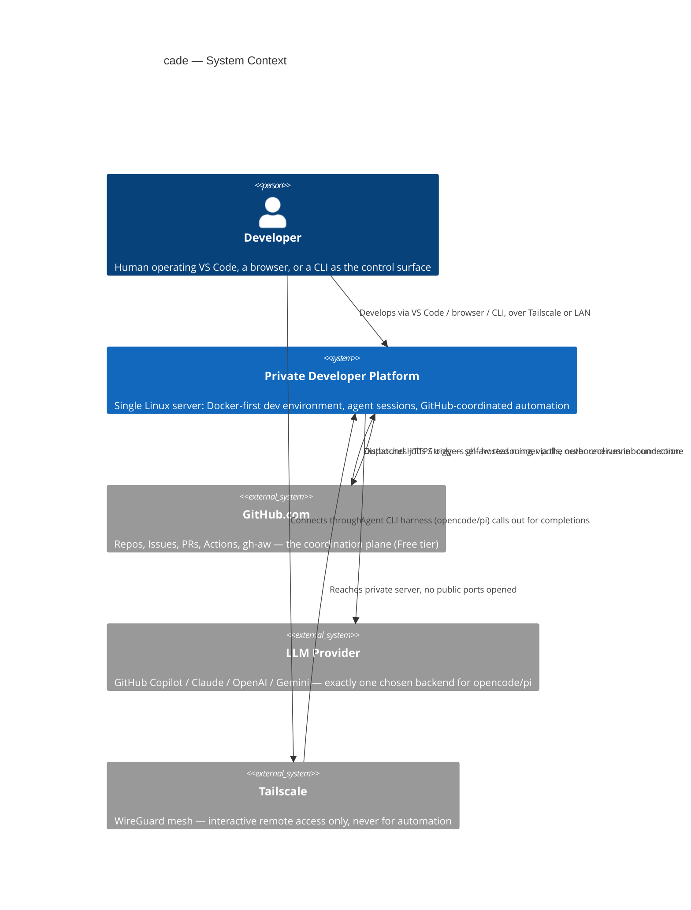
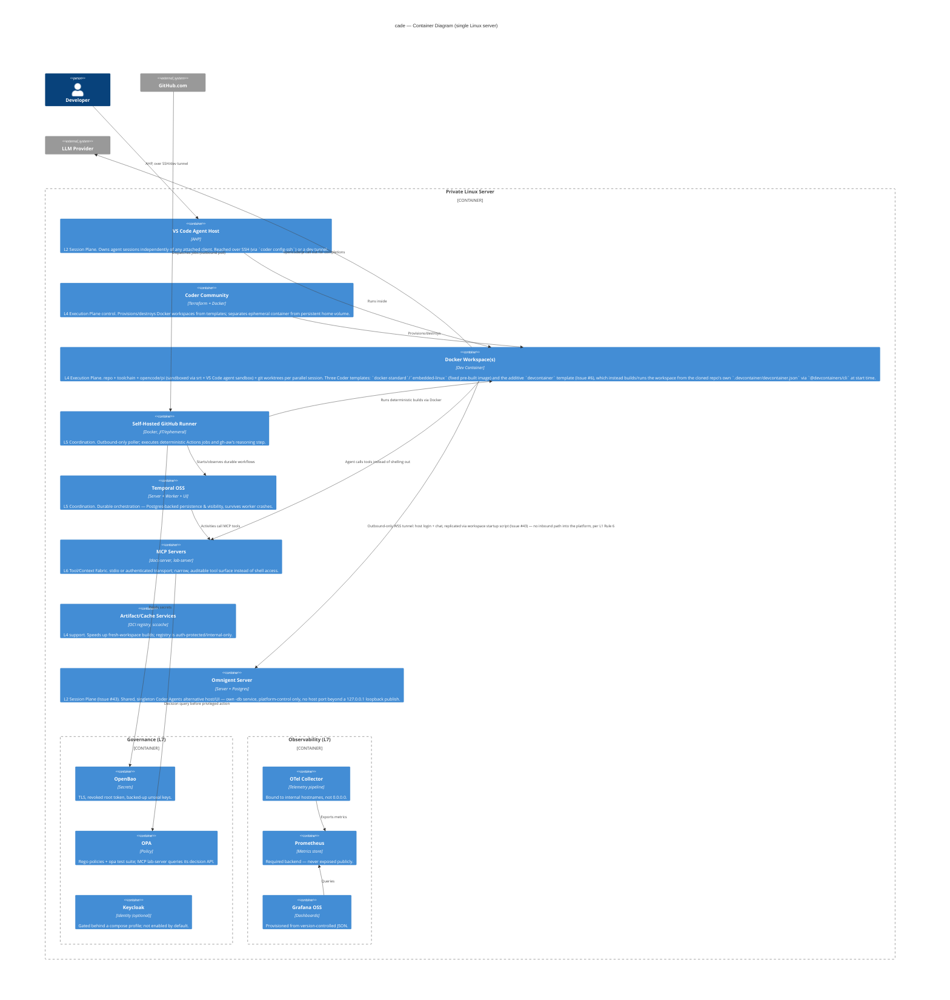
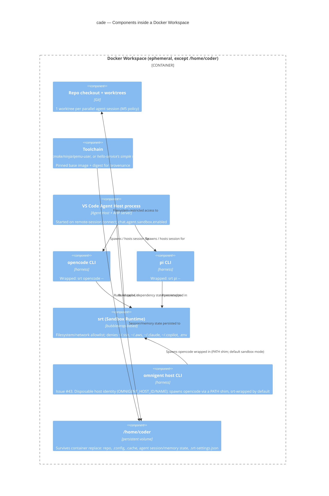

# Architecture — cade

Condensed C4-model view of the platform described in `docs/INITIAL.md` and `docs/cade.png`. This is a summary for quick orientation — `docs/INITIAL.md` (Section 2, the seven-layer model) remains the source of truth for details; this file must be kept in sync with it, not the other way around.

C4 levels used: **Context** (L1), **Container** (L2), **Component** (L3, one representative slice). A Code-level (L4) diagram is intentionally omitted — the codebase doesn't exist yet, and this doc will drift immediately if it tries to describe classes/functions before implementation.

---

## L1 — System Context

Who/what interacts with the platform, and what external systems it depends on.

**Key constraint (Rule 6):** every arrow into the platform is either the developer's own Tailscale/LAN connection, or GitHub's runner polling outbound — there is no inbound path that originates from outside.

---

## L2 — Container Diagram

The platform's internal building blocks, mapped to the seven-layer model (`docs/INITIAL.md` Section 2.1). "Container" here is a C4 container (a deployable/runnable unit — mostly Docker containers, in this platform's case almost literally).

---

## L3 — Component Diagram (representative slice: the Docker Workspace)

The workspace is the container most agents will actually work inside of, so it's the one slice worth a component-level breakdown.

---

## The Three Durability Levels (cross-cutting, applies to every container above)

This is the single most important cross-cutting property of the architecture (`docs/INITIAL.md` Section 2.2 / Rule 7) — do not assume proving one implies the others:

| Level | What survives | Proven by |
|---|---|---|
| UI durability | Closing/reopening VS Code | AHP / Agent Host (M4) |
| Workspace durability | Workspace container restart | Coder's persistent home volume (M3/M6, re-verified with a byte-exact marker file at M16) — a *template* property, not automatic |
| Process durability | Worker crash mid-execution | Temporal's Event History in Postgres (M8) |

---

## Maintenance note

This file is a **summary**, condensed on purpose. When a phase changes the architecture (new container, new component, changed data flow), update this file as part of that phase's mandatory "Documentation & Agent Instructions Update" step (see `docs/phases/README.md`), alongside `docs/architecture.md`, `docs/operations.md`, and `docs/security.md`. If this file and `docs/INITIAL.md` Section 2 ever disagree, `docs/INITIAL.md` wins until this file is corrected.

## Issue #5 MVP — Build-in-workspace Activity/Workflow

`temporal-worker` gained a scoped-down slice of the "run Temporal workflows
in predefined workspaces with build tools installed" feature: a
`run_build_command` Activity (`temporal/src/demo/build_activity.py`) uses
the `docker` Python SDK to run a single command in a short-lived container
built from `cade/coder-workspace:latest` (or any other pre-built image),
capture its stdout/stderr and exit code, and remove the container. A
minimal `BuildWorkflow` (`temporal/src/demo/build_workflow.py`) calls this
Activity once; `temporal/src/demo/build_starter.py` and
`make temporal-build-demo-start` trigger it manually. This is deliberately
the smallest useful slice of the issue's larger plan — no OPA policy gate,
no workspace-template-specific image selection, no multi-step build
pipeline — those remain follow-up work, not implemented here.

## Issue #43 (2026-08-30) — Omnigent host integration

Added the shared, singleton `omnigent-server` (+ its own `omnigent-db`
Postgres) as a new L2 Container, and `omnigent host CLI` as a new L3
Component inside the `agent-workspace` Docker Workspace, alongside
`srt`/`opencode`/`pi`. The `agent-workspace` template's startup script logs
in and runs `omnigent host ... --background --non-interactive` with a
disposable per-workspace host identity, spawning `opencode` through a PATH
shim that is `srt`-wrapped by default (`omnigent_sandbox_mode = "srt"`) —
no second, unsandboxed way to run agent turns. The workspace→server traffic
is an outbound-only WSS tunnel (workspace container dials out to
`omnigent-server:8000` on `platform-workspaces`), which is why the diagram
adds only a single `Rel(workspace, omnigent, ...)` arrow with no reverse
edge — consistent with L1 Rule 6 ("every arrow into the platform is either
the developer's own Tailscale/LAN connection, or GitHub's runner polling
outbound — there is no inbound path that originates from outside").

**Update, same day (live E2E verification):** brought up `omnigent-db` +
`omnigent-server` for real (scoped `docker compose up -d`, not the full
stack) and exercised the actual startup-script login/registration logic
against it via `docker run`/`docker exec`. Confirmed working end to end:
first-admin bootstrap (`OMNIGENT_ACCOUNTS_INIT_ADMIN_PASSWORD`/`_USERNAME`),
the real `POST /auth/login` + `store_token(...)` replication, and
`omnigent host --background --non-interactive` registering successfully
(`GET /v1/hosts` showed the expected host_id/name, status `online`). Three
real integration bugs surfaced and were fixed in the process (missing
`compose.yaml` env passthrough, wrong default admin username, and the
`OMNIGENT_HOST_ID`/`OMNIGENT_HOST_NAME` env-var mechanism being silently
dropped by the daemon's own env allowlist — fixed by writing
`~/.omnigent/config.yaml` directly instead) — see `AGENTS.md`'s Lessons
Learned for the full detail. The diagram/architecture shape above is
unchanged by these fixes; only the container's real env vars and the
startup script's identity-setting mechanism changed. Not yet verified live
through an actual `coder create` (no live Coder session in this
environment) — this ad-hoc `docker run`/`docker exec` proof is a scoped
stand-in, per this repo's own documented practice for validating
integration logic without a live Coder session.

**Update (Issue #45, 2026-08-30) — reverse Unix-socket bridge:** the
`coder create`-validated blocker this section's prior update deferred
turned out to be architectural, not a config gap: `srt`'s
`bwrap --unshare-net` gives the sandboxed `opencode serve` process its own
private network namespace, so its TCP loopback port is unreachable from
the unsandboxed `omnigent host` runner that needs to reach back into it —
no CLI flag/escape hatch exists in `srt` for this. Fixed with a reverse
Unix-socket bridge (Direction 4 of Issue #45's design space): Unix domain
sockets are filesystem objects, not network endpoints, so a socket file
under the shared `/tmp` bind-mount crosses the network-namespace boundary
even though a TCP port cannot. The `agent-workspace` template's
`startup_script` now runs an inside-sandbox `socat` relay (paired with
`opencode serve` inside the same `srt`/`bwrap` invocation) and an
outside-sandbox watchdog process that bridges a real TCP port back to
that Unix socket for `omnigent host` to dial. Verified fully working
end-to-end via a real omnigent chat session driving `opencode serve`
through the bridge to completion, with Issue #23's sandbox properties
(`denyRead`/`denyWrite`) confirmed not regressed. Full design rationale
and evidence: Issue #45 and `docs/milestone-reports/issue-45-bridge.md`.

